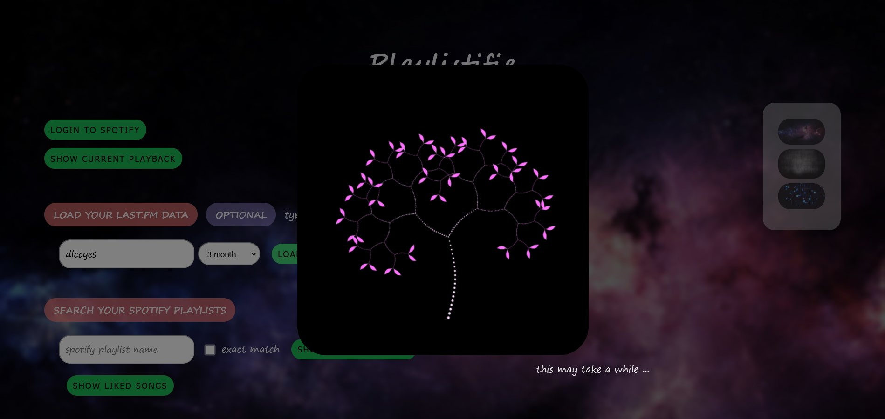
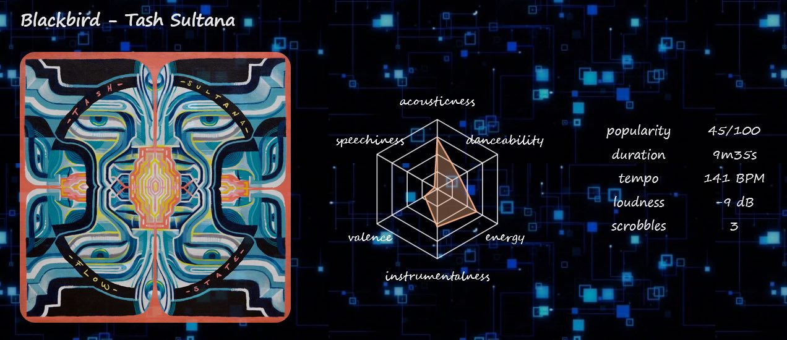
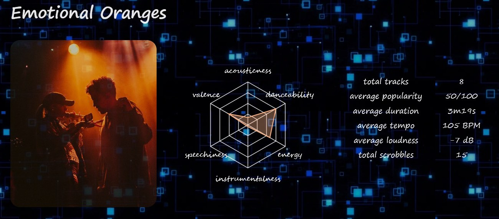
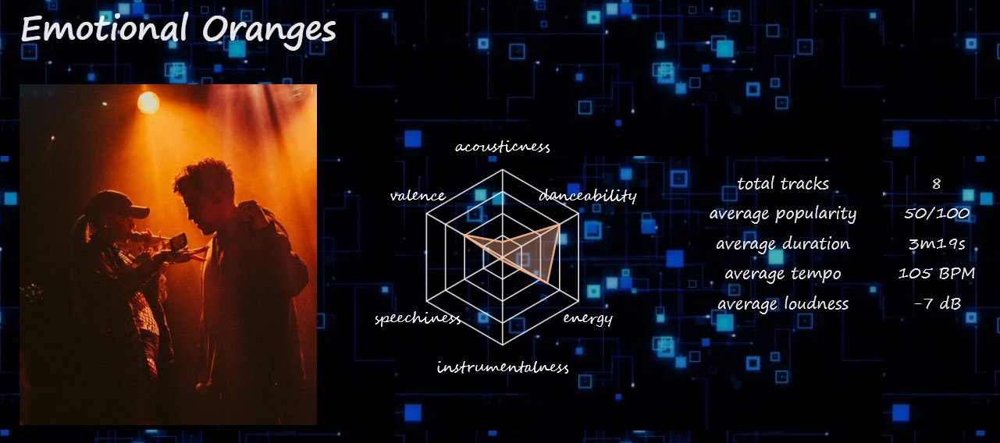
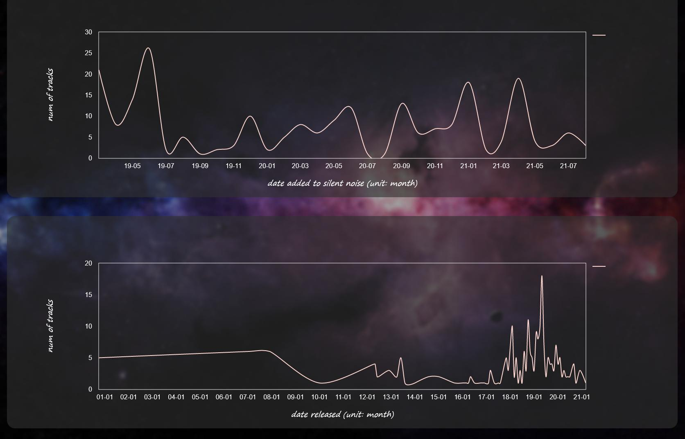
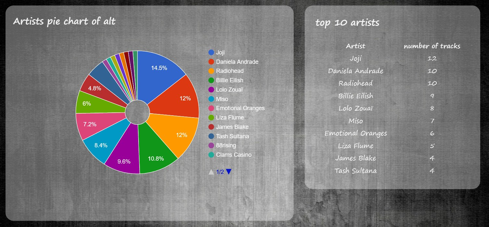
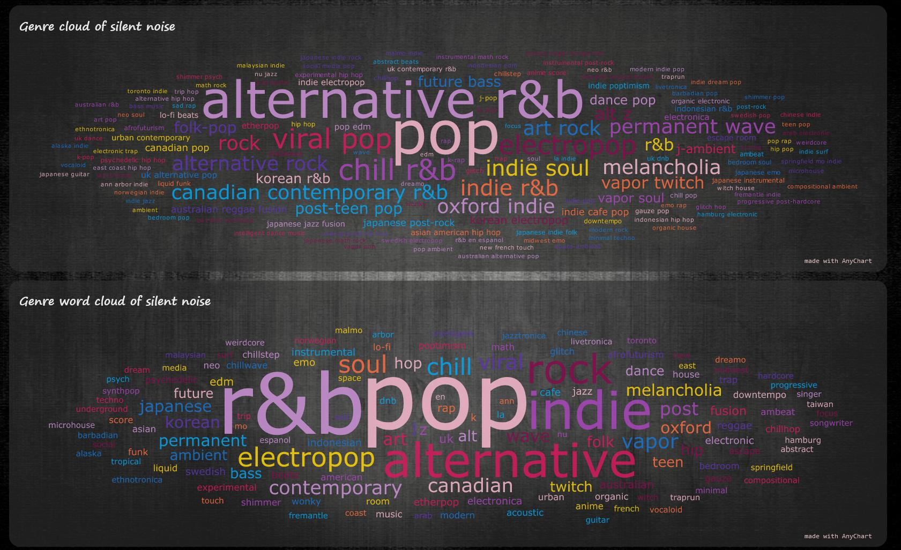

# Playlastify

**2022.11.05: The site has been migrated from Heroku to GCP Cloud Run**

*playlist+last.fm+spotify*

A webapp that visualize your Spotify playlist stats, and many more!

site url: <https://playlastify.web.app/> ([Heroku ver.](https://playlastify.herokuapp.com), may die anytime)  
source code: <https://github.com/dlccyes/playlastify>

## Intro

So there are tons of Spotify or last.fm stats websites out there, but what about ..... combining the 2? This webapp is focused on your **playlists** mainly. Login and enter one of your playlists' name, and you'll see some pretty detailed stats of the playlist, including **audio features radar chart**, **genre word cloud**, **date added/released line chart**, **artists pie chart** and more. And if you enter your last.fm username, you'll also see the **last.fm scrobbling stats** of your playlist and tracks! You'll see your most played songs, and you can also **search and sort anything in your playlist** (like you do in Spotify) and find out how many times you've listened to your songs!

## Features

### Custom background

Select from the 3 backgrounds I've set

### Last.fm scrobbling stats

Enter your last.fm username, select the range of date, and your scrobbling data will be loaded.

### Current playback

Details of the song you're currently playing, including scrobbles if you've entered your last.fm username.

<!--  -->

### Playlist details

Details of the playlist you've entered, including total scrobbles if you've entered your last.fm username.

<!--  -->

### Date added/released

Line chart of the added date (the date the song is added to this playlist) & released date (the date the song is released) of the songs in your playlist.

### Artist pie chart

Your top artists.

### Genre word cloud

So Spotify's classification of genres is pretty specific. You may see something like "australian alternative pop" for example, but "australian alternative pop" is still pop, isn't it? So this webapp will generate 2 kinds of genre cloud for you. The first is a word cloud from the genres of the artists in your playlist. The second is a word cloud from **EACH WORD** of your genres. For example, if you have 3 tropical house, 3 progressive house, 3 indie house & 3 house in your playlist, the 2nd word cloud will display "house" for the quantity of 12, which basically translate to **a word cloud of the big genres** of your playlist!

### Search and sort anything

Leave it blank to show everything in this playlist. Click any column title to sort (like you do in Spotify desktop). Will also show the total scrobbles of the results if you have entered your last.fm username.

